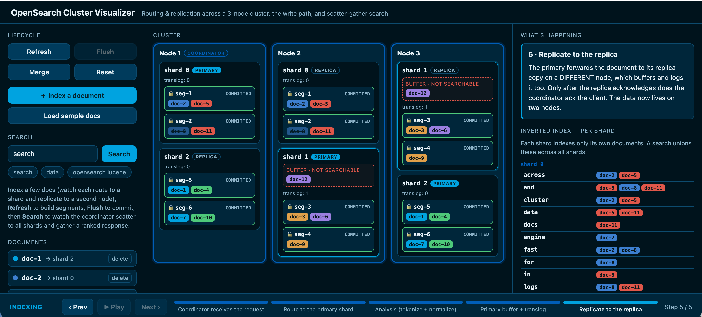

# OpenSearch Cluster Visualizer

An interactive, single-page teaching tool that shows how **OpenSearch / Lucene**
indexes and searches documents across a distributed cluster. Type a document,
click *Index*, and scrub step-by-step through the write path — watch it route to
a shard, replicate to a second node, land in an in-memory buffer, and (on
*Refresh*) become an immutable, searchable segment. Then *Flush*, *Merge*, and
run a *Search* that scatters across every node and is gathered into a ranked
response.

Everything is **simulated client-side** — no backend, no storage. It's built to
be screen-recorded and stepped through, not to be a configurable cluster.

**Live demo:** [opensearchvis.bitsculpt.top](https://opensearchvis.bitsculpt.top/)



## What it teaches

The whole point is to make the distinctions that usually get glossed over
*visible and steppable*:

- **Routing & replication** — `route(_id) → shard`, then the primary forwards to
  a replica on a *different* node, so every shard's data lives on two nodes.
- **The write path** — coordinator → primary → analysis (your words become
  terms) → buffer + translog (not searchable yet!) → replicate.
- **Refresh ≠ flush** — refresh turns buffered docs into immutable, *searchable*
  segments; flush makes them *durable* and clears the translog. They are
  separate steps for a reason.
- **Immutable segments & merges** — writes only ever create new segments; merges
  consolidate small ones and physically drop tombstoned (deleted) docs.
- **Scatter-gather search** — the coordinator fans the query out to one copy of
  every shard (query phase), each shard searches its own inverted index, and the
  coordinator merges, ranks, and fetches (query-then-fetch).
- **Per-shard inverted indexes** — each shard indexes only its own docs; a search
  unions posting lists across shards. That cross-shard union is the key "aha."

## Cluster topology

A single index with **3 primary shards**, **1 replica each**, across **3 nodes**.
A replica is never on the same node as its primary:

| Shard | Primary | Replica |
|-------|---------|---------|
| 0     | node-1  | node-2  |
| 1     | node-2  | node-3  |
| 2     | node-3  | node-1  |

node-1 is the coordinator by default.

## Running it

```bash
npm install
npm run dev      # start the Vite dev server
```

Then step through: **Index → Refresh → Flush → Merge → Search**. Use the bottom
stepper (Prev / Next / Play / Pause) to scrub any operation forwards and
backwards.

Other scripts:

```bash
npm run build    # production build to dist/
npm run preview  # serve the built dist/ locally
```

## Tech

React + Vite, with [Framer Motion](https://www.framer.com/motion/) driving the
stage animations. The core pattern is a **pure derivation of visible state from
`(cluster, op)`**, which is what lets the stepper scrub each operation in both
directions. See [`SPEC.md`](SPEC.md) for the authoritative behavior spec and the
OpenSearch-accuracy guardrails, and [`CLAUDE.md`](CLAUDE.md) for an architecture
overview.

## Honest simplifications

This is a teaching POC, so a few things stand in for the real thing (all
documented in [`SPEC.md`](SPEC.md)):

- Routing is a deterministic string hash standing in for murmur3 `_routing`.
- Relevance is term-frequency counting, a stand-in for BM25.
- Primary + replica are one logical shard rendered on two nodes (no replica lag).
- Coordinator is fixed to node-1; shard/replica/merge tuning is not exposed.

## Authorship

The vast majority of this project — the simulation model, the step-by-step
operation derivation, the UI, and the animations — was developed by
**Claude Opus 4.8** (Anthropic) via Claude Code.
